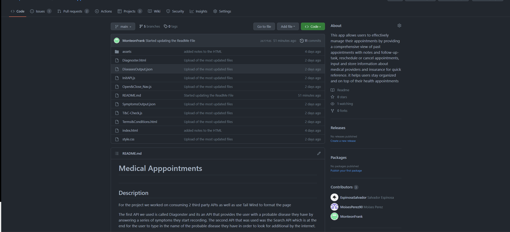
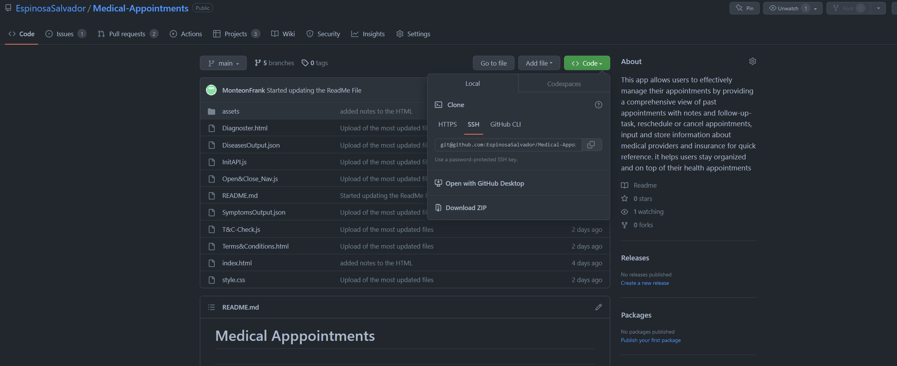
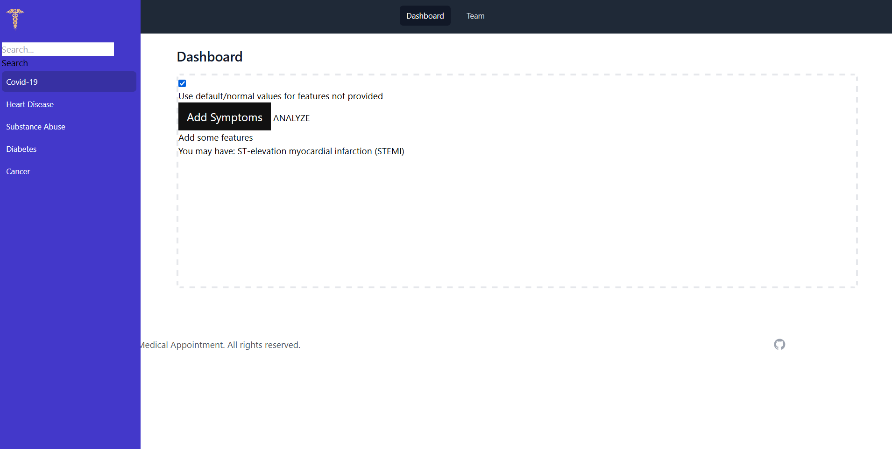
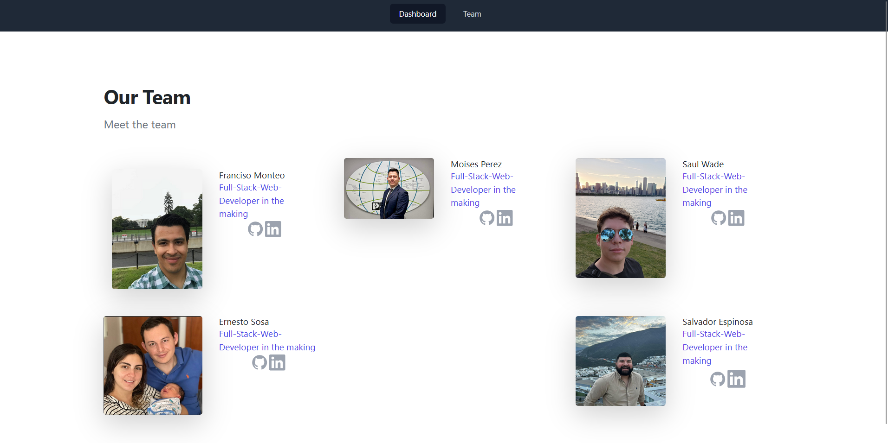

# Medical Appointment

## Table of Content

* [Introduction](#introduction)
* [Features](#features)
* [Requirements](#requirements)
* [Installation](#installation)
* [Configuration](#configuration)
* [What you should be able to see](#what-you-should-be-able-to-see)
* [Troubleshooting](#troubleshooting)
* [Next Phase Development](#next-phase-development)
* [FAQ (Frecuently Asked Questions)](#faq-frecuentrly-asked-questions)
* [Team](#team)

## Introduction

This app allows users to effectively manage their appointments by providing a comprehensive view of past appointments with notes and follow-up-task, reschedule or cancel appointments, input and store information about medical providers and insurance for quick reference. it helps users stay organized and on top of their health appointments

The first API we used is called Diagonster and its an API that provides the user with a probable disease they have by answering a series of symptoms they start recording. The second API that was used was the Search API which is at the end for the user to type in the name of the probable disease they have in order to look for additional by the internet.

## Features

This are the following feautures of the Medical Appointments
<!-- ! To be worked on -->

Allows developers to:
* Obtain a great variety of symptoms that any user could ever have.
* Select several symptoms that you are currently presenting.
* According to the selected user’s symptoms, the users can obtain some diseases that they could have, ordered by possibilities of have that specific disease.  

Allows developers to search between:
* Web Search
* News Search
* Image Search
* Auto Suggest Search
* Spell Check API


## Requirements

the requirements to run this webpage are really low due that we are only using *HTML*, *CSS* and *JS*.

* Vs code
* GitHub
* Internet
* Download JS to its latest release.

## Installation

To install this project please proceed to my [GitHub Repository](https://github.com/EspinosaSalvador/Medical-Appointments)

you should be able to see this,



Click on code as shown in the image



Copy the SSH key or the HTTPS key and open.

* Terminal
* Git bash
* CMD

either one of this will work. please proceed to the terminal an put in your Terminal,

```
git clone git@github.com:EspinosaSalvador/Medical-Appointments.git
```

and now you have a copy of the code.

## Configuration

If you want to do any configurations on this project please open a new branch you can do this by putting the following code in your terminal,

```
git checkout -b ＜new-branch＞
```

switch branches putting the following code on your terminal.

```
git checkout ＜branchname＞
```

If you want to show us your code and merge please open a pull request on [Github](https://github.com/EspinosaSalvador/Medical-Appointments/pulls).

## What you should be able to see

These is what you should be able to see in the Webpage, 


after you click that you should be able to see this page



and also there is a section where you can see our team 




## Troubleshooting

The Code Quiz is in version 1.0 ,please let me know if there are anybug in the webpage by issuing it in [Github](https://github.com/EspinosaSalvador/Medical-Appointments/issues)

## Next Phase Development

* Create refresh button to eliminate local storage

* Provide better format to the symptoms prompted

* Provide better format to search results

* Display all the search results per disease

* Complete and implement login page


## FAQ (Frecuentrly Asked Questions)

We will update this part when we have some frequently asked question.

## Team

* Francisco Monteon
* Moises Perez
* Saul Awade
* Ernesto Sosa
* Salvador Espinosa Valdez

